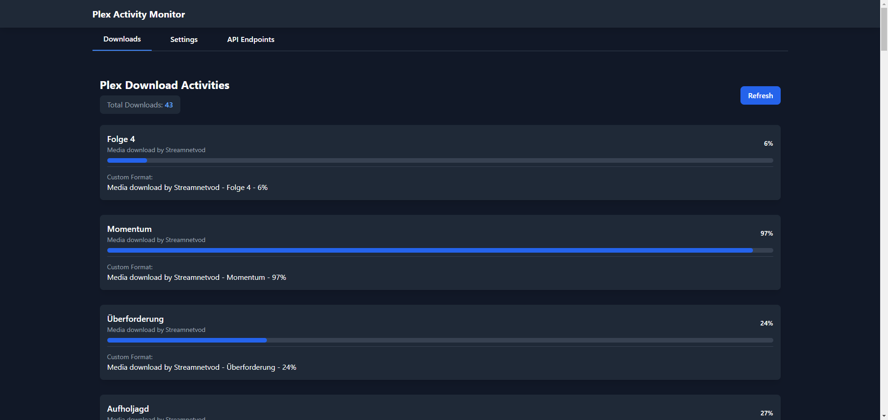
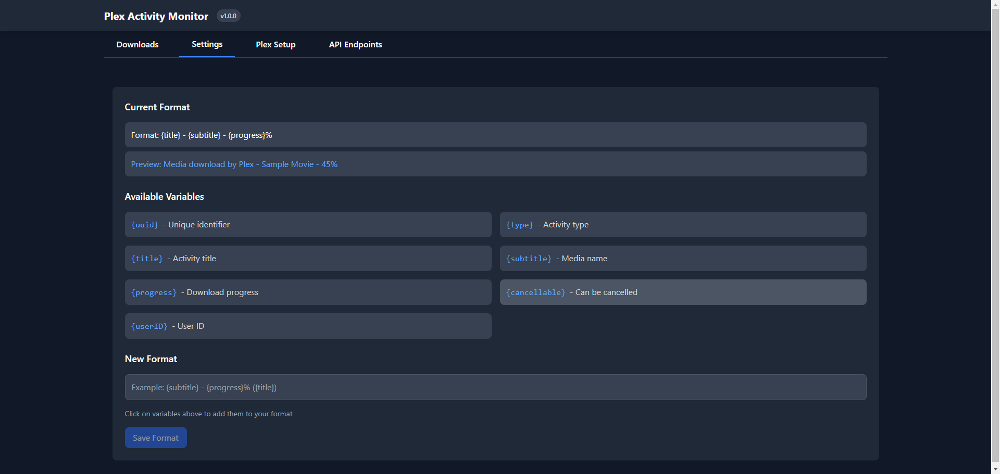

# Plex Activity Monitor

A React-based web application for monitoring Plex download activities with a dark mode interface, customizable output formatting, and API endpoints.





## Features

- 🎯 Real-time monitoring of Plex download activities
- 🌙 Dark mode interface
- 📊 Progress tracking with visual indicators
- 🔄 Auto-refresh every 15 seconds
- 🎨 Customizable output format with live preview
- 🚀 REST API for external access
- 📝 Detailed logging system
- 💾 Persistent configuration storage
- 🔐 Secure Plex server integration
- 🛠️ Easy configuration management

## Prerequisites

- Node.js (v18 or higher)
- NPM (v6 or higher)
- A Plex Media Server
- Plex Token for authentication

## Installation

1. Clone the repository:

```bash
git clone https://github.com/cyb3rgh05t/plex-api.git
cd plex-api
```

2. Install dependencies:

```bash
npm install
```

3. Build the application:

```bash
npm run build
```

4. Start the server:

```bash
npm start
```

The application will be available at `http://localhost:3005`

## Configuration

Initial setup can be done through the UI:

1. Access the "Plex Setup" tab
2. Enter your Plex server URL and token
3. Test the connection
4. Save the configuration

## Features Overview

### Downloads Tab

- View all current Plex download activities
- Real-time progress tracking
- Auto-refresh every 15 seconds

### Settings Tab

- Customize output format
- Live preview of format changes
- Click-to-add variable system
- Available variables:
  - {uuid} - Unique identifier
  - {type} - Activity type
  - {title} - Activity title
  - {subtitle} - Media name
  - {progress} - Download progress
  - {cancellable} - Can be cancelled
  - {userID} - User ID

### Plex Setup Tab

- Configure Plex server connection
- Test connection functionality
- Secure token storage
- Visual feedback for connection status

### API Endpoints Tab

- Complete API documentation
- Base URL information
- Request/Response examples
- Color-coded HTTP methods
- Copy-enabled code blocks

## API Endpoints

### Main Endpoints

- GET /api/plex/activities - Fetch Plex activities
- POST /api/config - Save Plex configuration
- GET /api/config - Get current configuration
- GET /api/activities - Get formatted activities
- POST /api/update - Update activities and format

### Utility Endpoints

- POST /api/test-connection - Test Plex server connection
- GET /api/debug - Debug information (development only)

## Development

Start the development server:

```bash
npm run dev
```

This will start:

- React development server
- API server with auto-reload
- Live code updates

## Docker Support

Build the Docker image:

```bash
docker build -t plex-activity-monitor .
```

Run with Docker Compose:

```yaml
version: "3.9"
services:
  plex-api:
    image: "ghcr.io/cyb3rgh05t/plex-api:latest"
    container_name: "plex-api"
    environment:
      - "TZ=${TZ}"
      - "NODE_ENV=production"
    ports:
      - "3005:3005"
    volumes:
      - plex-api-config:/app/config
    restart: unless-stopped
```

## Troubleshooting

Common issues:

1. **Connection Failed**

   - Verify Plex server URL format
   - Check token validity
   - Ensure server is accessible

2. **Format Not Saving**

   - Check for valid format syntax
   - Verify variables are properly enclosed in {}

3. **API Errors**
   - Check server logs
   - Verify endpoint URLs
   - Ensure proper request format

## Contributing

1. Fork the repository
2. Create your feature branch
3. Commit your changes
4. Push to the branch
5. Create a Pull Request

## License

This project is licensed under the MIT License.

## Authors

- **cyb3rgh05t** - _Initial work_

## Acknowledgments

- Built with React
- Styled with Tailwind CSS
- Express.js backend
- Plex Media Server API
